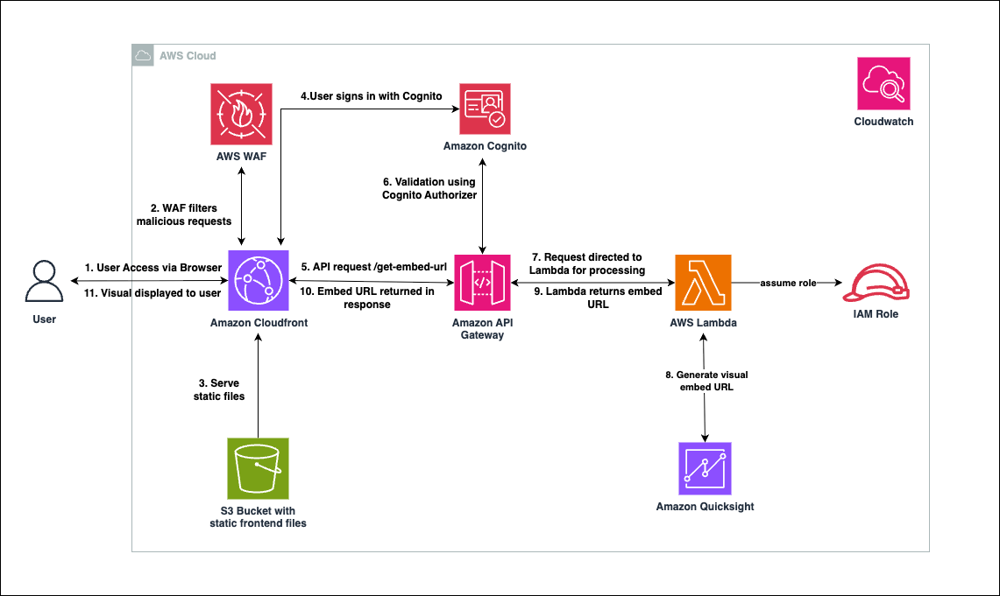

# Amazon QuickSight Visual Embedding in React

This project demonstrates how to:
- Embed individual QuickSight visuals (not entire dashboards) in a React web application
- Generate embed URLs dynamically using AWS Lambda and API Gateway
- Provide a seamless user experience with loading states and error handling

**Perfect for:** Organizations wanting to integrate specific QuickSight charts/graphs into their custom web applications.

## Architecture



### Architecture Flow

1. User access via browser: The user opens the web application using a browser. The request is routed to an Amazon CloudFront distribution, which acts as a content delivery network for the app.

2. WAF filters malicious requests: Before the request reaches CloudFront, it passes through AWS WAF. WAF inspects the traffic and blocks any malicious or suspicious requests based on security rules.

3. S3 serves static files: If the request is clean, CloudFront retrieves the static frontend assets (HTML, JS, CSS) from a private S3 bucket using Origin Access Control (OAC) and delivers them to the browser.

4. User signs in via Cognito: Once the app is loaded, the user signs in through Amazon Cognito, which authenticates the user and returns a secure JWT token for authorized API access.

5. API request to /get-embed-url: After login, the React app makes a secure call to the /get-embed-url endpoint on API Gateway, passing the JWT token in the request header for authentication.

6. Validation using Cognito Authorizer: API Gateway validates the token using a Cognito Authorizer. If the token is valid, the request proceeds; otherwise, it is denied with a 401 Unauthorized response.

7. Request directed to Lambda for processing: The validated request is then forwarded to a backend Lambda function. This function is responsible for generating the embed URL for the requested QuickSight visual.

8. Lambda generates embed URL from QuickSight: Using an IAM role with appropriate permissions, Lambda calls the GenerateEmbedUrlForRegisteredUser QuickSight API to generate a secure, user-scoped visual URL.

9. Lambda returns embed URL to API Gateway: Once the embed URL is generated, Lambda sends it back to API Gateway as part of a JSON response. This response is then prepared for delivery to the frontend.

10. Embed URL returned in response to CloudFront and user: The embed URL is returned to the browser as the API response.

11. Visual displayed to user: The React app receives the response and uses QuickSight Embedding SDK to render the specific visual seamlessly.


## Prerequisites

### AWS Services Required
- **AWS Account** with appropriate permissions
- **Amazon QuickSight** account with at least one dashboard containing visuals

### Development Environment
- Node.js (v16 or higher)
- npm or yarn
- This project uses Vite as the build tool (not Create React App)
- AWS Amplify libraries for Cognito custom authentication UI components

### QuickSight Requirements
- QuickSight dashboard with the visual you want to embed
- Dashboard ID, Sheet ID, and Visual ID

## Setup Instructions

### 1. Clone the Repository

```bash
git clone <repository-url>
cd embedding-quicksight-visuals-in-react-app
```

### 2. Deploy CloudFormation Stack

1. **Open AWS CloudFormation Console**
   - Navigate to AWS CloudFormation in your AWS Console
   - Click "Create stack" → "With new resources (standard)"

2. **Upload Template**
   - Choose "Upload a template file"
   - Select the `template.yaml` file from the repository root
   - Click "Next"

3. **Configure Stack Parameters**
   - **Stack name**: `quicksight-embedding-stack`
   - No additional parameters required (Lambda handles user registration automatically)
   - Click "Next"

4. **Configure Stack Options**
   - Leave default settings or configure as needed
   - Click "Next"

5. **Review and Deploy**
   - Review all settings
   - Check "I acknowledge that AWS CloudFormation might create IAM resources"
   - Click "Submit"

6. **Wait for Deployment**
   - Stack creation takes 5-10 minutes
   - Monitor the "Events" tab for progress
   - Wait for status to show "CREATE_COMPLETE"

#### Get Stack Outputs

Once deployed, go to the "Outputs" tab and note down:
- **ApiGatewayUrl**: API Gateway endpoint URL
- **UserPoolId**: Cognito User Pool ID
- **UserPoolClientId**: Cognito User Pool Client ID
- **CloudFrontDomainName**: CloudFront distribution domain
- **S3BucketName**: S3 bucket name for website hosting

### 3. Configure Frontend Environment

#### Create Environment File
Create `.env` file in the `my-app` directory:

```env
# AWS Configuration
VITE_AWS_REGION=us-east-1

# Cognito Configuration (from CloudFormation outputs)
VITE_USER_POOL_ID=us-east-1_xxxxxxxxx
VITE_USER_POOL_WEB_CLIENT_ID=xxxxxxxxxxxxxxxxxxxxxxxxxx

# API Configuration (from CloudFormation outputs)
VITE_API_URL=https://your-api-id.execute-api.us-east-1.amazonaws.com/prod

# QuickSight Visual Configuration
VITE_DASHBOARD_ID=your-dashboard-id
VITE_SHEET_ID=your-sheet-id
VITE_VISUAL_ID=your-visual-id
```

**Note**: Replace the values with:
- Cognito values from CloudFormation outputs
- API URL from CloudFormation outputs
- QuickSight visual IDs from your dashboard

#### Get QuickSight Visual Information
1. Open your QuickSight dashboard
2. Click on the 3 dots menu of any visual
3. Note down the **Dashboard ID**, **Sheet ID**, and **Visual ID**

### 4. Setup User Authentication

#### Option A: Create User in Cognito User Pool
1. Go to AWS Cognito Console
2. Select your User Pool (from CloudFormation outputs)
3. Go to "Users" tab
4. Click "Create user"
5. Enter email and temporary password
6. User will need to change password on first login

#### Option B: Enable Sign-Up in UI
1. Open `my-app/src/auth/AuthWrapper.jsx`
2. Change line 38: `hideSignUp={true}` to `hideSignUp={false}`
3. Users can now register themselves from UI

**Note**: QuickSight users are automatically registered by the Lambda function when they first access the application. No manual QuickSight user setup required.

#### Grant QuickSight Dashboard Access
**Important**: Each login user must be granted access to the QuickSight dashboard:

1. Go to QuickSight Console
2. Navigate to your dashboard
3. Click "Share" → "Share dashboard"
4. Enter the user's email address (same as Cognito login email)
5. Select appropriate permissions (Viewer recommended)
6. Click "Share"

**Note**: Users will not be able to view embedded visuals without proper dashboard permissions in QuickSight.

### 5. Build and Deploy Frontend

#### Install Dependencies and Build
```bash
cd my-app
npm install
npm run build
```

#### Upload to S3 Bucket
   - Go to S3 Console
   - Open the bucket from CloudFormation outputs
   - Upload all contents from the `my-app/dist/` folder
   - Make sure to upload files, not the dist folder itself

#### Create CloudFront Invalidation
1. Go to CloudFront Console
2. Select your distribution (from CloudFormation outputs)
3. Go to "Invalidations" tab
4. Click "Create invalidation"
5. Enter `/*` as the object path
6. Click "Create invalidation"
7. Wait for invalidation to complete (2-3 minutes)

### 6. QuickSight Domain Configuration

**Important**: Add your CloudFront domain to QuickSight allowlist:

1. Go to QuickSight Console
2. Click on your profile → "Manage QuickSight"
3. Go to "Domains and Embedding"
4. Add your CloudFront domain:
   ```
   https://d1234567890abc.cloudfront.net
   ```
5. Click "Add domain"

### 7. Access Your Application

1. **Get CloudFront Domain**
   - Use the CloudFront domain from CloudFormation outputs
   - Format: `https://d1234567890abc.cloudfront.net`

2. **Test the Application**
   - Open the CloudFront domain in your browser
   - Sign in with your Cognito user credentials
   - The QuickSight visual should load and display

### 8. Troubleshooting

#### Common Issues:

1. **"Domain not allowed" error**
   - Ensure CloudFront domain is added to QuickSight allowlist
   - Check that the domain format is correct (https://)

2. **Authentication errors**
   - Verify Cognito User Pool ID and Client ID in .env
   - Ensure user exists in the User Pool

3. **API Gateway errors**
   - Check API Gateway URL in .env file
   - Verify Cognito authorizer is properly configured

4. **Visual not loading**
   - Confirm Dashboard ID, Sheet ID, and Visual ID are correct
   - Check QuickSight user permissions
   - Verify Lambda function has proper IAM permissions
   - **Ensure the login user's email has been granted access to the QuickSight dashboard**

5. **"User does not have access" error**
   - Verify the user's email is shared with the QuickSight dashboard
   - Check dashboard sharing permissions in QuickSight Console

## Security Considerations

This solution implements comprehensive security best practices across all layers:

### Authentication & Authorization
- **Amazon Cognito User Pools**: Secure JWT tokens with strong password policies and optional MFA
- **Multi-Factor Authentication**: Optional TOTP-based MFA using authenticator apps (Google Authenticator, Authy, etc.)
- **Email-Based User Registration**: Automatic QuickSight user provisioning with READER role
- **API Gateway Cognito Authorizers**: JWT token validation for all API requests
- **QuickSight Registered User Embedding**: No anonymous access, user-specific permissions

### Network Security
- **AWS WAF**: Layer 7 application firewall with comprehensive protection:
  - Common attack protection (OWASP Top 10)
  - Bot control and IP reputation filtering
  - Rate limiting (1000 requests/min per IP)
- **CloudFront**: Global CDN with TLS 1.2+ enforcement and access logging

### Data Protection
- **Encryption at Rest**: 
  - S3 buckets with AES-256 server-side encryption
  - Versioning enabled on all S3 buckets
- **Encryption in Transit**: 
  - HTTPS/TLS 1.2+ for all communications
  - Secure API endpoints with proper headers
- **Data Access Control**: 
  - S3 bucket policies restricting access to CloudFront only
  - Origin Access Control (OAC) for secure content delivery
  - Public access blocked on all S3 buckets
  - Dedicated logging bucket with secure access policies

### Infrastructure Security
- **IAM Least Privilege**: 
  - Lambda execution roles with minimal QuickSight permissions
  - Service-specific IAM policies
  - Resource-level access controls
- **API Security**:
  - Usage plans with throttling (100 req/sec) and daily quotas (10,000/day)
  - API Gateway caching enabled for performance and cost optimization
- **Lambda Security**:
  - Reserved concurrent executions (10) to prevent resource exhaustion
  - Secure environment variable handling
  - Proper error handling and logging

### Logging & Monitoring
- **S3 Access Logging**: Dedicated logging bucket for website access logs
- **CloudFront Logging**: Request logging for monitoring and analysis
- **Secure Log Storage**: Encrypted log storage with proper access controls
- **Deny Policies**: Explicit denial of unencrypted uploads and non-HTTPS access

## Security Recommendations

For production environments, consider these additional security measures:

- **Custom Domain & SSL Certificate**: Configure a custom domain with AWS Certificate Manager SSL certificate for CloudFront instead of using the default CloudFront domain
- **KMS Encryption**: Use customer-managed KMS keys for S3 and CloudWatch logs
- **WAF Enhancements**: Add custom rules, geo-blocking, and SQLi/XSS protection
- **Monitoring**: Enable CloudWatch alarms, AWS Config and CloudTrail
- **Access Control**: Implement granular policies, cross-account roles, and API key rotation
- **Compliance**: Align with relevant frameworks (SOC 2, GDPR, HIPAA) and conduct regular security assessments

## Production Deployment

The CloudFormation template automatically sets up secure infrastructure including:

- **S3 Buckets**: Private buckets with versioning, AES-256 encryption, and dedicated logging bucket
- **CloudFront Distribution**: Global CDN with WAF protection, TLS 1.2+, and access logging
- **WAF Web ACL**: 5-layer protection (Common rules, Known bad inputs, Bot control, IP reputation, Rate limiting)
- **Cognito User Pool**: Enterprise-grade authentication with strong password policies and optional MFA
- **API Gateway**: Secure RESTful API with Cognito authorization, usage plans, and caching
- **Lambda Function**: Serverless compute with reserved concurrency and proper IAM roles
- **Logging Infrastructure**: Comprehensive logging with secure storage and access controls

### Monitoring and Maintenance:

- CloudWatch logs for Lambda function
- WAF metrics and logging
- API Gateway request metrics

### Scaling Considerations:

- CloudFront provides global CDN
- Lambda automatically scales
- API Gateway handles high request volumes
- Cognito supports millions of users

## Configuration

### Environment Variables Reference

| Variable | Description | Example |
|----------|-------------|---------|
| `VITE_AWS_REGION` | AWS region for Cognito | `us-east-1` |
| `VITE_USER_POOL_ID` | Cognito User Pool ID | `us-east-1_AbCdEfGhI` |
| `VITE_USER_POOL_WEB_CLIENT_ID` | Cognito App Client ID | `1234567890abcdefghijklmnop` |
| `VITE_API_URL` | API Gateway endpoint | `https://api.amazonaws.com/prod` |
| `VITE_DASHBOARD_ID` | QuickSight Dashboard ID | `12345678-1234-1234-1234-123456789012` |
| `VITE_SHEET_ID` | QuickSight Sheet ID | `sheet1` |
| `VITE_VISUAL_ID` | QuickSight Visual ID | `visual1` |

## Features

- **Secure Authentication**: Cognito-based user authentication
- **Individual Visual Embedding**: Embed specific visuals, not entire dashboards
- **Responsive Design**: Works on desktop and mobile devices

## Benefits of Individual Visual Embedding with Registered Users

This implementation provides specific advantages for embedding single QuickSight visuals:

### Visual-Level Benefits
- **Focused Data Display**: Show only the specific chart/graph needed, not entire dashboards
- **Clean Integration**: Embed visuals seamlessly into your React app without QuickSight UI chrome

### Security & Access Control
- **User-Specific Visual Access**: Each logged-in user sees data based on their QuickSight permissions
- **Email-Based Authorization**: User's login email determines their data access level in QuickSight
- **No Direct QuickSight Access**: Users never need QuickSight console access or separate accounts

### Cost & Operational Benefits
- **Pay-Per-User Model**: Only pay for users who actually view the embedded visual
- **No Dashboard Licensing**: Avoid costs of full dashboard embedding for simple visual needs
- **Simplified User Management**: Manage access through familiar Cognito authentication

## Usage

### Basic Usage
```jsx
import QuickSightVisual from './components/QuickSightVisual';

function App() {
  return (
    <div>
      <h1>My Dashboard</h1>
      <QuickSightVisual 
        dashboardId="your-dashboard-id"
        sheetId="your-sheet-id"
        visualId="your-visual-id"
        height="400px"
        width="100%"
      />
    </div>
  );
}
```

### Multiple Visuals
```jsx
function Dashboard() {
  return (
    <div>
      <div style={{ display: 'flex', gap: '20px' }}>
        <QuickSightVisual 
          visualId="sales-chart"
          height="300px"
          width="50%"
        />
        <QuickSightVisual 
          visualId="revenue-chart"
          height="300px"
          width="50%"
        />
      </div>
    </div>
  );
}
```

## Additional Resources

- [Amazon QuickSight Embedding SDK](https://github.com/awslabs/amazon-quicksight-embedding-sdk)
- [AWS Amplify Documentation](https://docs.amplify.aws/)
- [Amazon Cognito Developer Guide](https://docs.aws.amazon.com/cognito/)
- [QuickSight Embedding Documentation](https://docs.aws.amazon.com/quicksight/latest/user/embedded-analytics.html)

